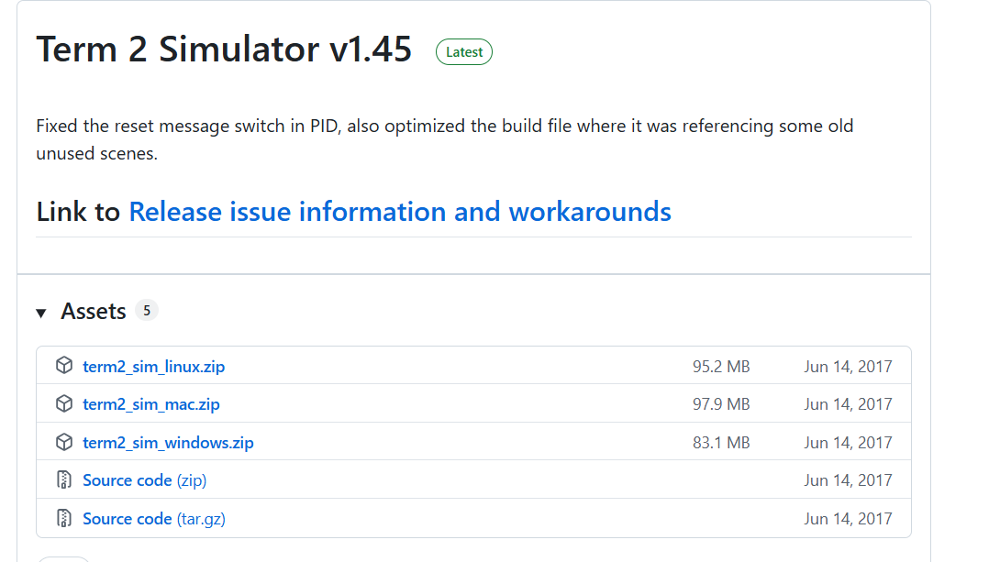
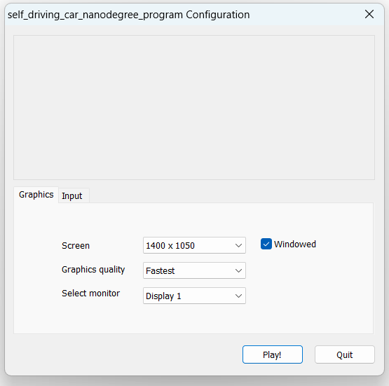

# 1. Download the Pre-Compiled Windows Simulator

1. Go to the [Udacity Self-Driving Car Simulator Releases](https://github.com/udacity/self-driving-car-sim/releases).  
2. Download the **Windows ZIP file** for the latest version.  

3. Extract the ZIP file anywhere on your computer.  
4. Run the `.exe` file inside to launch the simulator.  

